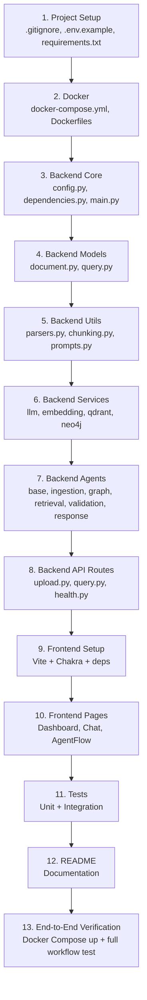

# KnowledgeHive — Detailed Implementation Plan

Enterprise Knowledge Swarm powered by Multi-Agent AI

## 🚦 Current Status & Handover

> [!NOTE]
> **Current Status (Phase 1 MVP): 100% COMPLETE ✅**
> 
> Everything detailed in this document (from Project Setup to End-to-End Verification) has been fully implemented and tested. The MVP is fully functional.
>
> **For Teammates:** You do not need to implement any of the files listed below. Your starting point should be **Phase 2 (Architecture Hardening)** as outlined in the `README.md` Roadmap. This document remains here as an architectural reference of how Phase 1 was built.

---

## Background

This document served as the blueprint for building the functional MVP that demonstrates multi-agent knowledge retrieval end-to-end: **Upload → Parse → Embed → Graph → Query → Retrieve → Validate → Answer**.

---

## User Review Required

> [!IMPORTANT]
> **OpenRouter API Key**: The LLM layer uses OpenRouter as the initial provider. You will need a valid `OPENROUTER_API_KEY` and a chosen model (e.g., `google/gemini-2.0-flash-001`, `meta-llama/llama-3-70b-instruct`). Please confirm your preferred model.

> [!IMPORTANT]
> **Neo4j & Qdrant**: Docker Compose will spin up both. Neo4j Community Edition requires accepting the license (`NEO4J_ACCEPT_LICENSE_AGREEMENT=yes`). Qdrant runs without auth by default. Confirm this is acceptable for MVP.

> [!WARNING]
> **Sentence Transformers model**: Default will be `all-MiniLM-L6-v2` (~80MB). This runs locally on CPU. If you prefer a different model or GPU-based embedding, let me know.

> [!IMPORTANT]
> **Chakra UI version**: I'll use Chakra UI v2 (the stable, well-documented version) with Vite. Confirm this is acceptable vs. Chakra v3.

---

## Open Questions

1. **LLM Model**: Which OpenRouter model should we default to? I'll default to `google/gemini-2.0-flash-001` if no preference.
2. **Auth**: No authentication for MVP — is that correct? We'll add it in a later phase.
3. **File size limits**: Should we cap upload file size? I'll default to 50MB.
4. **Chunk size**: Default chunking strategy will be 512 tokens with 50-token overlap. Acceptable?

---

## Architecture Decisions

| Decision | Choice | Rationale |
|---|---|---|
| **Agent pattern** | Custom Python classes with `BaseAgent` ABC | Simple, testable, easy to swap for AutoGen later |
| **LLM abstraction** | `LLMProvider` protocol + `OpenRouterProvider` | Provider pattern allows swapping OpenAI/Azure later |
| **Embedding abstraction** | `EmbeddingProvider` protocol + `SentenceTransformerProvider` | Same pattern, locally run for MVP |
| **Vector store abstraction** | `VectorStore` protocol + `QdrantVectorStore` | Qdrant via `qdrant-client` |
| **Graph store abstraction** | `GraphStore` protocol + `Neo4jGraphStore` | Neo4j via `neo4j` driver |
| **Dependency injection** | FastAPI `Depends()` + `dependencies.py` | Lightweight, framework-native |
| **Async** | Full async FastAPI, async Qdrant client, async Neo4j driver | Production-ready from day one |
| **Frontend state** | TanStack Query for server state, React Context for UI state | Industry standard, minimal boilerplate |
| **Chunking** | Recursive text splitter (custom, LangChain-inspired) | No LangChain dependency in MVP |

---

## Proposed Changes

### 1. Project Setup & Configuration

#### [NEW] [.gitignore](file:///c:/mihir_workspace/microsoft-hackathon/knowledge-hive/.gitignore)
Standard Python + Node + Docker gitignore.

#### [NEW] [.env.example](file:///c:/mihir_workspace/microsoft-hackathon/knowledge-hive/.env.example)
Template for all environment variables:
- `OPENROUTER_API_KEY`, `OPENROUTER_MODEL`
- `QDRANT_HOST`, `QDRANT_PORT`
- `NEO4J_URI`, `NEO4J_USER`, `NEO4J_PASSWORD`
- `EMBEDDING_MODEL`
- `UPLOAD_DIR`

#### [NEW] [requirements.txt](file:///c:/mihir_workspace/microsoft-hackathon/knowledge-hive/requirements.txt)
```
fastapi[standard]>=0.104.0
uvicorn[standard]>=0.24.0
pydantic>=2.5.0
pydantic-settings>=2.1.0
python-multipart>=0.0.6
httpx>=0.25.0
qdrant-client>=1.7.0
neo4j>=5.14.0
sentence-transformers>=2.2.0
python-docx>=1.1.0
PyPDF2>=3.0.0
pytest>=7.4.0
pytest-asyncio>=0.21.0
pytest-cov>=4.1.0
aiofiles>=23.2.0
```

#### [MODIFY] [README.md](file:///c:/mihir_workspace/microsoft-hackathon/knowledge-hive/README.md)
Full project README with setup instructions, architecture overview, usage guide.

---

### 2. Docker

#### [NEW] [docker-compose.yml](file:///c:/mihir_workspace/microsoft-hackathon/knowledge-hive/docker-compose.yml)
Services:
- **backend**: Python 3.11, FastAPI, port 8000
- **frontend**: Node 20, Vite dev server, port 5173
- **qdrant**: Official image, port 6333
- **neo4j**: Community Edition 5.x, ports 7474 (browser) + 7687 (bolt)
- Redis/Celery commented out for future phases

#### [NEW] [docker/backend.Dockerfile](file:///c:/mihir_workspace/microsoft-hackathon/knowledge-hive/docker/backend.Dockerfile)
Multi-stage: install deps → copy code → run uvicorn.

#### [NEW] [docker/frontend.Dockerfile](file:///c:/mihir_workspace/microsoft-hackathon/knowledge-hive/docker/frontend.Dockerfile)
Multi-stage: install deps → dev server for MVP.

---

### 3. Backend — Core Layer

#### [NEW] [backend/main.py](file:///c:/mihir_workspace/microsoft-hackathon/knowledge-hive/backend/main.py)
FastAPI app factory with:
- CORS middleware
- Lifespan handler (init/shutdown Qdrant, Neo4j connections)
- Router mounting (`/api/upload`, `/api/query`, `/api/health`)

#### [NEW] [backend/core/config.py](file:///c:/mihir_workspace/microsoft-hackathon/knowledge-hive/backend/core/config.py)
Pydantic `Settings` class loading from `.env`:
- All connection strings, API keys, model names
- Upload directory, chunk size, overlap

#### [NEW] [backend/core/dependencies.py](file:///c:/mihir_workspace/microsoft-hackathon/knowledge-hive/backend/core/dependencies.py)
FastAPI dependency functions that provide:
- `get_settings()`
- `get_llm_service()`
- `get_embedding_service()`
- `get_qdrant_service()`
- `get_neo4j_service()`
- Agent factory functions

---

### 4. Backend — Services Layer (Abstractions + Implementations)

#### [NEW] [backend/services/llm_service.py](file:///c:/mihir_workspace/microsoft-hackathon/knowledge-hive/backend/services/llm_service.py)
- `LLMProvider` Protocol: `async def generate(prompt, system_prompt, temperature) -> str`
- `OpenRouterProvider` implementation via `httpx` calling OpenRouter API
- Structured to allow future `AzureOpenAIProvider`, `OpenAIProvider`

#### [NEW] [backend/services/embedding_service.py](file:///c:/mihir_workspace/microsoft-hackathon/knowledge-hive/backend/services/embedding_service.py)
- `EmbeddingProvider` Protocol: `async def embed(texts) -> list[list[float]]`
- `SentenceTransformerProvider` wrapping `sentence-transformers`
- Lazy model loading (load on first call)

#### [NEW] [backend/services/qdrant_service.py](file:///c:/mihir_workspace/microsoft-hackathon/knowledge-hive/backend/services/qdrant_service.py)
- `VectorStore` Protocol: `store_vectors()`, `search()`
- `QdrantVectorStore`: Create collection if not exists, upsert points, search with filters
- Collection name: `knowledge_hive`

#### [NEW] [backend/services/neo4j_service.py](file:///c:/mihir_workspace/microsoft-hackathon/knowledge-hive/backend/services/neo4j_service.py)
- `GraphStore` Protocol: `store_entities()`, `store_relationships()`, `query_subgraph()`
- `Neo4jGraphStore`: Create nodes/relationships via Cypher, query related entities
- Node types: `Document`, `Entity`, `Concept`
- Relationship types: `MENTIONS`, `RELATES_TO`, `PART_OF`

---

### 5. Backend — Models

#### [NEW] [backend/models/document.py](file:///c:/mihir_workspace/microsoft-hackathon/knowledge-hive/backend/models/document.py)
Pydantic models:
- `DocumentUpload` (response)
- `DocumentChunk` (internal)
- `DocumentMetadata`

#### [NEW] [backend/models/query.py](file:///c:/mihir_workspace/microsoft-hackathon/knowledge-hive/backend/models/query.py)
Pydantic models:
- `QueryRequest`
- `QueryResponse` (answer, sources, confidence, agent_flow)
- `AgentStep` (agent_name, status, duration, output_summary)
- `Source` (document_name, chunk_text, relevance_score)

---

### 6. Backend — Utilities

#### [NEW] [backend/utils/chunking.py](file:///c:/mihir_workspace/microsoft-hackathon/knowledge-hive/backend/utils/chunking.py)
Recursive text chunker:
- Split by paragraphs → sentences → words
- Target ~512 tokens, 50-token overlap
- Return list of `DocumentChunk`

#### [NEW] [backend/utils/parsers.py](file:///c:/mihir_workspace/microsoft-hackathon/knowledge-hive/backend/utils/parsers.py)
File parsers:
- `parse_pdf()` via PyPDF2
- `parse_docx()` via python-docx
- `parse_txt()` — plain read
- Router function `parse_document(file_path, content_type) -> str`

#### [NEW] [backend/utils/prompts.py](file:///c:/mihir_workspace/microsoft-hackathon/knowledge-hive/backend/utils/prompts.py)
All LLM prompt templates as string constants:
- Entity extraction prompt
- Relationship extraction prompt
- Answer generation prompt
- Validation prompt

---

### 7. Backend — Agents

All agents inherit from `BaseAgent` with:
```python
class BaseAgent(ABC):
    name: str
    async def execute(self, context: dict) -> AgentResult
```

#### [NEW] [backend/agents/base_agent.py](file:///c:/mihir_workspace/microsoft-hackathon/knowledge-hive/backend/agents/base_agent.py)
`BaseAgent` ABC + `AgentResult` dataclass (status, output, duration, error).

#### [NEW] [backend/agents/ingestion_agent.py](file:///c:/mihir_workspace/microsoft-hackathon/knowledge-hive/backend/agents/ingestion_agent.py)
Pipeline: Parse file → Chunk → Embed → Store in Qdrant.
- Input: file path, document_id
- Output: chunk count, vector IDs

#### [NEW] [backend/agents/graph_agent.py](file:///c:/mihir_workspace/microsoft-hackathon/knowledge-hive/backend/agents/graph_agent.py)
Pipeline: Take chunks → LLM extract entities/relationships → Store in Neo4j.
- Input: chunks, document_id
- Output: entity count, relationship count

#### [NEW] [backend/agents/retrieval_agent.py](file:///c:/mihir_workspace/microsoft-hackathon/knowledge-hive/backend/agents/retrieval_agent.py)
Pipeline: Embed query → Search Qdrant → Query Neo4j for related entities → Merge context.
- Input: query string
- Output: relevant chunks + graph context

#### [NEW] [backend/agents/validation_agent.py](file:///c:/mihir_workspace/microsoft-hackathon/knowledge-hive/backend/agents/validation_agent.py)
Pipeline: Take retrieved context + query → LLM score relevance → Rank sources → Confidence score.
- Input: query, retrieved chunks
- Output: validated sources, confidence score

#### [NEW] [backend/agents/response_agent.py](file:///c:/mihir_workspace/microsoft-hackathon/knowledge-hive/backend/agents/response_agent.py)
Pipeline: Take validated context + query → LLM generate answer with citations.
- Input: query, validated context
- Output: final answer, citations, sources

---

### 8. Backend — API Routes

#### [NEW] [backend/api/upload.py](file:///c:/mihir_workspace/microsoft-hackathon/knowledge-hive/backend/api/upload.py)
`POST /api/upload`:
1. Accept file upload (PDF/DOCX/TXT)
2. Save to upload directory
3. Run Ingestion Agent
4. Run Graph Agent
5. Return `{document_id, status, chunks_created, entities_created}`

#### [NEW] [backend/api/query.py](file:///c:/mihir_workspace/microsoft-hackathon/knowledge-hive/backend/api/query.py)
`POST /api/query`:
1. Accept query string
2. Run Retrieval Agent
3. Run Validation Agent
4. Run Response Agent
5. Return `{answer, sources, confidence, agent_flow}`

#### [NEW] [backend/api/health.py](file:///c:/mihir_workspace/microsoft-hackathon/knowledge-hive/backend/api/health.py)
`GET /api/health`:
- Check Qdrant connectivity
- Check Neo4j connectivity
- Return status of each service

---

### 9. Frontend — Setup

#### [NEW] [frontend/package.json](file:///c:/mihir_workspace/microsoft-hackathon/knowledge-hive/frontend/package.json)
Created via `npx create-vite@latest` with React template.

Dependencies:
- `@chakra-ui/react`, `@emotion/react`, `@emotion/styled`, `framer-motion`
- `axios`
- `@tanstack/react-query`
- `react-router-dom`
- `react-icons`

---

### 10. Frontend — Pages & Components

#### [NEW] [frontend/src/App.jsx](file:///c:/mihir_workspace/microsoft-hackathon/knowledge-hive/frontend/src/App.jsx)
Root app with Chakra Provider, React Query Provider, React Router.
Routes: `/` (Dashboard), `/chat` (Chat), `/agents` (Agent Flow).

#### [NEW] [frontend/src/pages/Dashboard.jsx](file:///c:/mihir_workspace/microsoft-hackathon/knowledge-hive/frontend/src/pages/Dashboard.jsx)
- File upload dropzone (PDF, DOCX, TXT)
- Upload progress + status
- Knowledge stats cards (documents, chunks, entities, relationships)
- Recent uploads list

#### [NEW] [frontend/src/pages/Chat.jsx](file:///c:/mihir_workspace/microsoft-hackathon/knowledge-hive/frontend/src/pages/Chat.jsx)
- Chat input
- Message bubbles with markdown rendering
- Sources panel with relevance scores
- Confidence badge
- Agent execution timeline

#### [NEW] [frontend/src/pages/AgentFlow.jsx](file:///c:/mihir_workspace/microsoft-hackathon/knowledge-hive/frontend/src/pages/AgentFlow.jsx)
- Visual pipeline: Ingestion → Graph → Retrieval → Validation → Response
- Each agent card shows: name, status (idle/running/completed/failed), duration
- Animated connections between agents
- Real-time status during query execution

#### [NEW] [frontend/src/components/UploadBox.jsx](file:///c:/mihir_workspace/microsoft-hackathon/knowledge-hive/frontend/src/components/UploadBox.jsx)
Drag-and-drop file upload with file type validation and progress bar.

#### [NEW] [frontend/src/components/ChatWindow.jsx](file:///c:/mihir_workspace/microsoft-hackathon/knowledge-hive/frontend/src/components/ChatWindow.jsx)
Scrollable chat container with message rendering and auto-scroll.

#### [NEW] [frontend/src/components/AgentStatus.jsx](file:///c:/mihir_workspace/microsoft-hackathon/knowledge-hive/frontend/src/components/AgentStatus.jsx)
Individual agent status card with icon, name, status badge, timing.

#### [NEW] [frontend/src/components/Navbar.jsx](file:///c:/mihir_workspace/microsoft-hackathon/knowledge-hive/frontend/src/components/Navbar.jsx)
Top navigation bar with logo, page links, theme toggle.

#### [NEW] [frontend/src/services/api.js](file:///c:/mihir_workspace/microsoft-hackathon/knowledge-hive/frontend/src/services/api.js)
Axios instance + API functions:
- `uploadDocument(file)`
- `queryKnowledge(question)`
- `getHealth()`

#### [NEW] [frontend/src/theme.js](file:///c:/mihir_workspace/microsoft-hackathon/knowledge-hive/frontend/src/theme.js)
Custom Chakra theme: dark mode default, brand colors (amber/honey hive-themed), typography (Inter font).

---

### 11. Tests

#### [NEW] [tests/backend/test_parsers.py](file:///c:/mihir_workspace/microsoft-hackathon/knowledge-hive/tests/backend/test_parsers.py)
Unit tests for PDF, DOCX, TXT parsing.

#### [NEW] [tests/backend/test_chunking.py](file:///c:/mihir_workspace/microsoft-hackathon/knowledge-hive/tests/backend/test_chunking.py)
Unit tests for chunking logic (size, overlap, edge cases).

#### [NEW] [tests/backend/test_agents.py](file:///c:/mihir_workspace/microsoft-hackathon/knowledge-hive/tests/backend/test_agents.py)
Unit tests for each agent with mocked services.

#### [NEW] [tests/backend/test_api.py](file:///c:/mihir_workspace/microsoft-hackathon/knowledge-hive/tests/backend/test_api.py)
Integration tests for `/api/upload`, `/api/query`, `/api/health` endpoints.

#### [NEW] [tests/backend/conftest.py](file:///c:/mihir_workspace/microsoft-hackathon/knowledge-hive/tests/backend/conftest.py)
Shared pytest fixtures: mock services, test client, sample files.

---

## Execution Order

The implementation will proceed in this exact order:



---

## Verification Plan

### Automated Tests
```bash
# Backend unit tests
cd backend && python -m pytest ../tests/backend/ -v --cov=. --cov-report=term

# Specific test suites
python -m pytest ../tests/backend/test_parsers.py -v
python -m pytest ../tests/backend/test_chunking.py -v
python -m pytest ../tests/backend/test_agents.py -v
python -m pytest ../tests/backend/test_api.py -v
```

### Integration Verification
```bash
# Start infrastructure
docker compose up -d qdrant neo4j

# Run backend
cd backend && uvicorn main:app --reload

# Test health
curl http://localhost:8000/api/health

# Test upload (with a sample PDF)
curl -X POST http://localhost:8000/api/upload -F "file=@sample.pdf"

# Test query
curl -X POST http://localhost:8000/api/query -H "Content-Type: application/json" -d '{"question": "What is this document about?"}'
```

### End-to-End Workflow
1. `docker compose up` — all services start
2. Open frontend at `http://localhost:5173`
3. Upload a PDF document
4. Verify chunks created + entities extracted
5. Ask a question about the document
6. Verify answer with citations + confidence score
7. View agent flow visualization

### Manual Verification
- Browser test: Navigate Dashboard → Upload file → Chat → Ask question → View AgentFlow
- Verify all agent status transitions display correctly
- Confirm sources and confidence scores render properly
